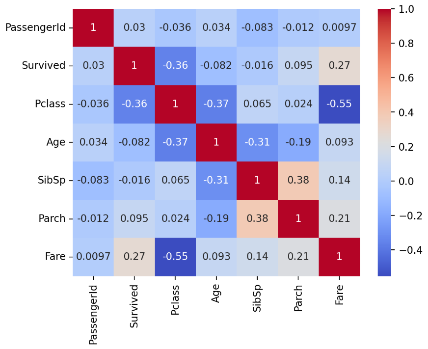

# Project 3: ML Streamlit App
## Project Overview 📌
The ML Streamlit App is an intereactive Supervised MAchine Learning Web App built with Streamlit. The goal of this project is to allow users to have freedom in explorings, training, and visualizing learning models with a dataset of thier coice. While the Titanic dataset is uploaded as an example, users have discretion to upload thier own dataset, select a target column for prediction, choose from four machine-learning omdels,, and tune hyperpramerters. THrough model training, performance metrics are available with explanations. 

## How to Run the App on Your Machine 🧩
**1. Clone the repository** 
```bash
$ git clone https://github.com/Toohig-Data-Science-Portfolio/MLStreamlitApp
cd ML Streamlit App
```
**2. Start a virtual environment and get the dependencies (requires uv):**
```bash
$ uv venv
$ .venv/bin/activate
$ uv sync
```
**3. Start the app locally**
```bash
$ streamlit run MLStreamlitApp.py
```
### Necessary Libraries and Machines 
**Core libraries:**
- streamlit (1.32+)
- pandas (2.0+)
- numpy (1.24+)
- matplotlib (3.7+)
- seaborn (0.13+)
-scikit-learn (1.3+)

**Install these libraries:**
```bash
pip install -r requirements.txt
```

**Link to the deployed version in Streamlit Cloud**
XXX

## App Features
**The app includes four supervised learning models:** 
1. Logistic Regression
- Used for binary classification
- Hyperparameter: C
- Visualization: Top feature coeffcients
2. K-Nearest Neighbors (KNN)
- Distance-based classifier
- Hyperparameter: k (# of neighbors)
- Visualization: K vs. Accuracy curve
3. Decsion Tree 
- Rule-based model that spilts data into branches
- Hyperparameter: max_depth
- Visualizatoin: Tree diagram
4. Random Forest
- Combination of multiple decison trees
- Hyperparameters: n_estimators (# of trees), max_depth
- VisualizationL Top 10 feature importances 

**Hyperparameter Tuning:**
The hyperprameters for each model are updated upon model selction, and indluded in the left sidebar.The sliders can be adjusted, and the model will update automatically. There is no need for manual retraining. 

## Graphs and Interactions Involved 📊
All graphs below are derived from the Titanic Dataset. 
**Correlation Heatmap**


**Logistic Regression**


**K-Nearest Neighbors**


**Decision Tree**


**Random Forest**


## References 
[Pandas Cheat Sheet](https://pandas.pydata.org/Pandas_Cheat_Sheet.pdf)
[Tidy Data Cheat Sheet](https://vita.had.co.nz/papers/tidy-data.pdf)