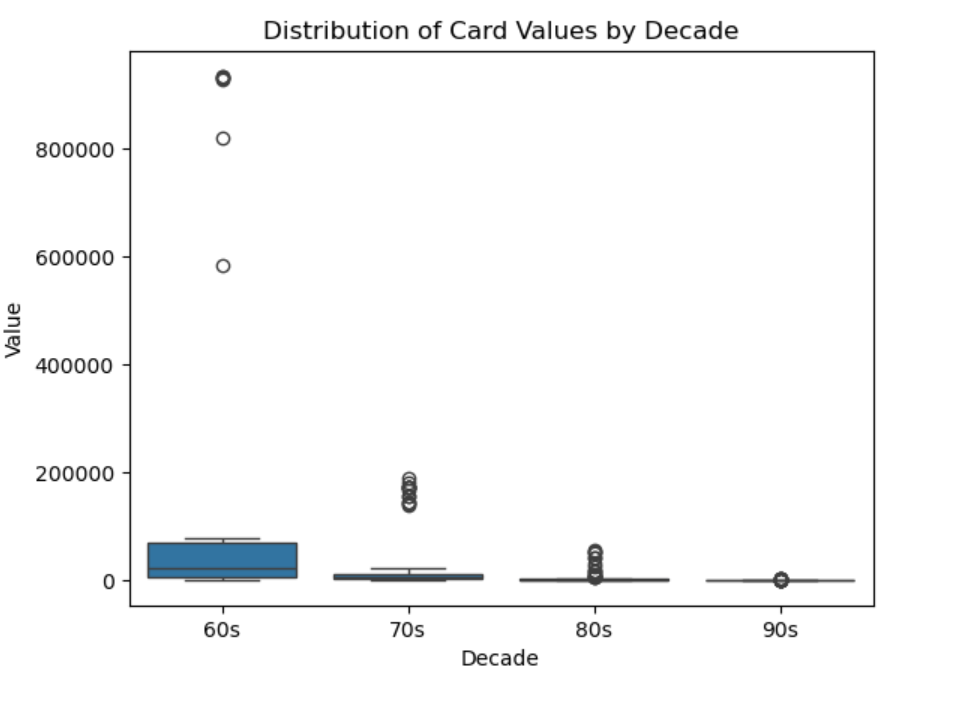
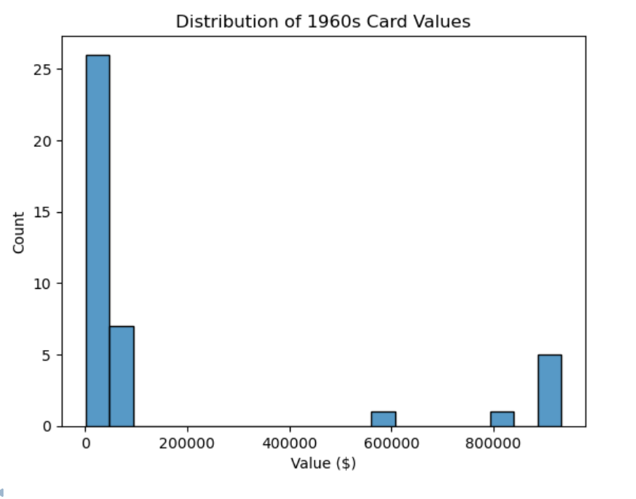
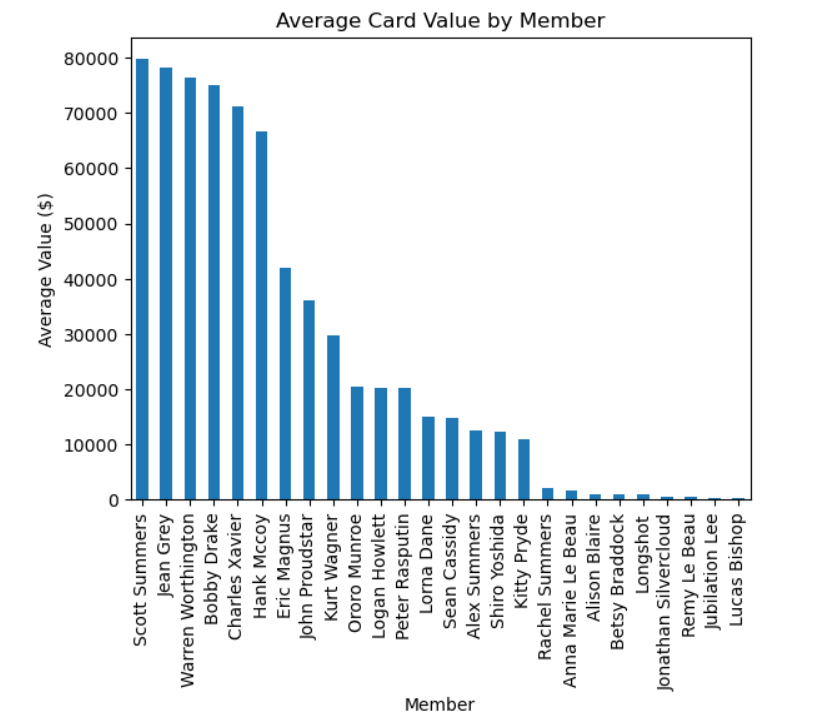
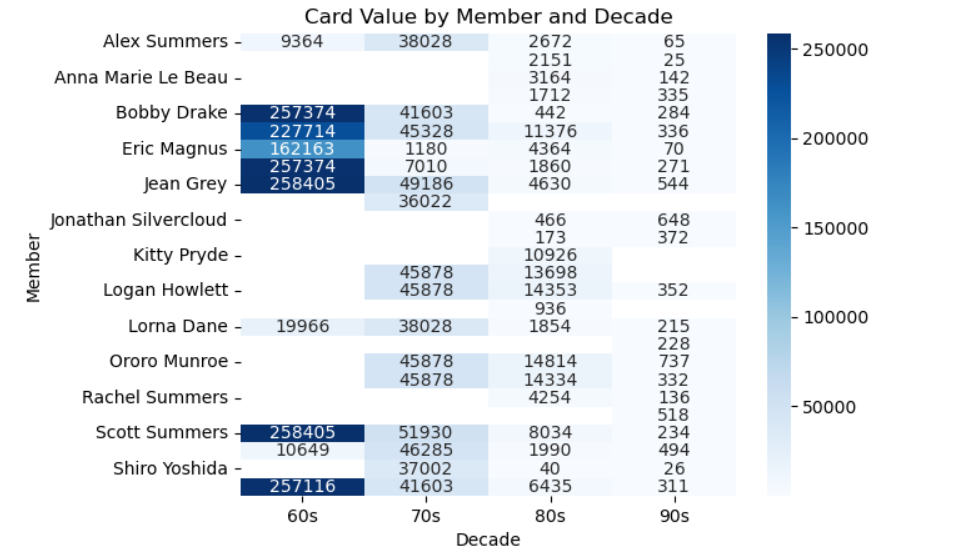

# Project Overview 

This project analyzes the Mutant Moneyball Dataset, looking at observations regarding the value, as defined by U.S monetary dollars, of X-men trading cards. Upon first download of the data, cleanising is necessary in order to tidy up the dataframe, and get it ready for use and further exploration. In this project, the Member, or X-Men name, column was used as the unique identifer throughout. Based on this, the observations regarding each card were cleansed to represent four variables: Memeber, Decade, Source, and Value. Furthermore, the tidy data principles, that each variable forms a column, each observations forms a row, and each value is a cell, was carried out to fulfill the goal of exploratory analysis. Tidy data is important for data structure, the use of data analytics tools, and aggregation, so that we can find key insights about the value of these trading cards based on the four variables.

# Instructions 
1. In order to run this notebook, we must import the appropriate dataset and libraries. First, the libraries improted into this project are pandas, matplotlib.pyplot, and seaborn. Pandas was used for data cleaning, transformation, and analysis, for example, in loading the dataset, reshaping the data, creating the pivot tables, and cleaning the column names. 
Matplotlib.pyplot was used to create figures and plots, which is crucial for visualization purposes. Lastly, seaborn was also used for visualizations, specifically, the boxplot and heatmap. The combination of these three libraries' capabilites allow for both the tidy data process as well as exploratory analysis. 
2. The dataset is the "Mutant Moneyball" dataset, which can be downloaded to the notebook as a CSV file. 
3. Furthermore, to continue thorughout the project, we must be familiar with the tidy data process. After the tidy data process is complete, the dataset can be analyzied thorugh many different lenses. Moreover, tidying data is structuring a dataset to facilitate analysis. The first step in tidying the mutant Moneyball dataset was converting the dataset from wide to long format using the .melt() method. This is becasue we have multiple columns representing the same information. With this process, each row should represent a single observation. 
4. Next, there were still multiple values represented in the Variable column. We have to split up these values into separate columns using the .str.split() method. This makes the dataset easier to read. 
5. After splitting the Variable column, we placed the title Total Value with Decade, which is more specific to the data, which represents years, in that column. 
6. Lastly, a few more maintenence cleaning steps were taken to clean up the charcter names from the member columns, and convert to uniform, numeric values in the Value column. 
7. After completing these tidy data steps, I was able to explore the dataset for trends, patterns, and outliers. The main focus in this project was looking at card value over time, and the rarity of each card. However, after ocmpelting the tidy data process, analysis is not limited, and can be performed in many different ways.   

# Dataset Description

The Mutant Moneyball Dataset comes from Github, and is a CSV file, which can be downloaded locally from your computer. The dataset visualizes X-Men trading card value data, decade by decade, from the creation of X-Men in 1963 up to 1993. For context, X-Men are characters dervived from comic books, and are mutant humans born with a gentic trait called the X-gene that gives them superhuman capabilites. Each observation in the dataset is represented through four variables: the name of the X-men character (Member column), the time period (Decade column), the marketplace (Source column), and the price of the card in U.S dollars (Value column). By cleaning the data and analyzing these four variables, we can analyze purchasing trends, trends over time, the most valuable characters, and prices across various marketplaces. 

# References
[Pandas Cheat Sheat](https://pandas.pydata.org/Pandas_Cheat_Sheet.pdf)

[Tidy Data Cheat Sheat](https://vita.had.co.nz/papers/tidy-data.pdf)

# Visuals used in the Project 
Below are visulizations used in the project. Visit the notebook here, link, to learn more about the code.

<<<<<<< HEAD

=======
>>>>>>> db7db9313ab6acc883fd149573a87adb86ce3ce3
